# ***Understanding Bash Scripting***

## **Bash**

Bash (Bourne Again SHell) is a command language interpreter for Unix-like operating systems. It provides a command-line interface for users to interact with the operating system and execute commands. Bash is a program that reads and executes commands you type or put into a file. It's really good at doing things automatically and helping you control Linux computers.

 Writing Your First Script
 1. Open a text editor such as nano or vim and create a new file named `hello.sh`.
2. In the text editor, enter the script: `echo "Hello World!"`
3. Save the file and exit the text editor.

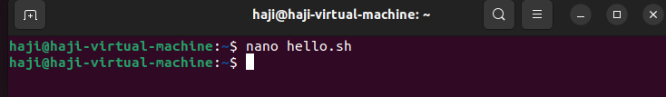
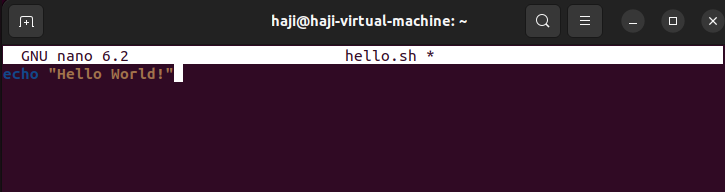

Before we can run the script, we need to make it executable. Change the file's permissions to executable.

- Syntax:
```markdown


 `chmod +x hello.sh`

```

Now, let's execute the script. You can either use any of the following commands:

- `./hello.sh`
- `bash hello.sh`

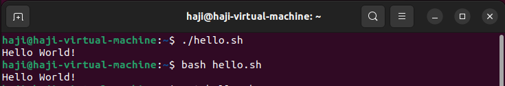


## **Comments**

Comments in bash scripts start with the `#` symbol. They are ignored by the interpreter and are used to provide explanations or documentation within the script.

```bash
# This is a comment
echo "Hello World!"
```
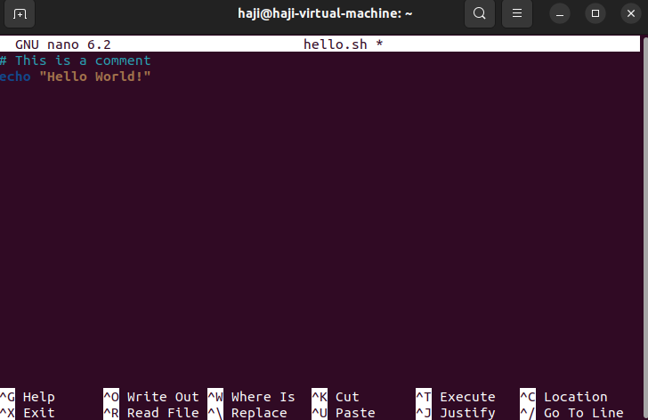


## **Variables**

Variables in bash scripts store data that can be referenced and manipulated throughout the script.

```bash
NAME="Saklain"
echo "Hello $NAME!"
```
{


## **User Input**

You can prompt the user for input using the `read` command.

```bash
echo "What is your name?"
read NAME
echo "Hello, $NAME!"
```
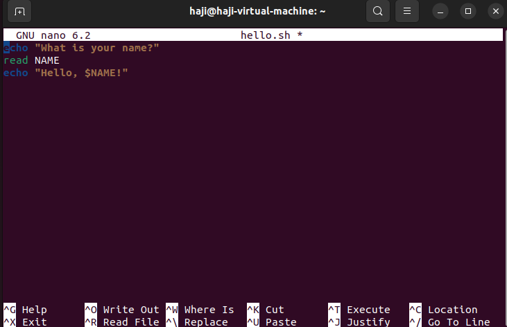
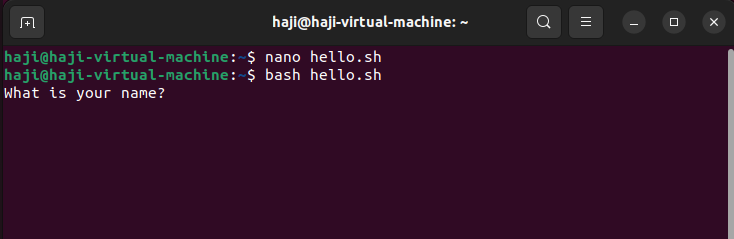
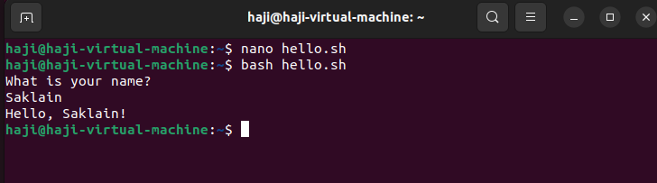


## **Conditional Statements (if-else)**

Conditional statements allow you to execute code based on certain conditions.

```bash
echo "Enter a number:"
read NUM

if [ $NUM -gt 0 ]; then
    echo "$NUM is positive."
elif [ $NUM -lt 0 ]; then
    echo "$NUM is negative."
else
    echo "$NUM is zero."
fi
```
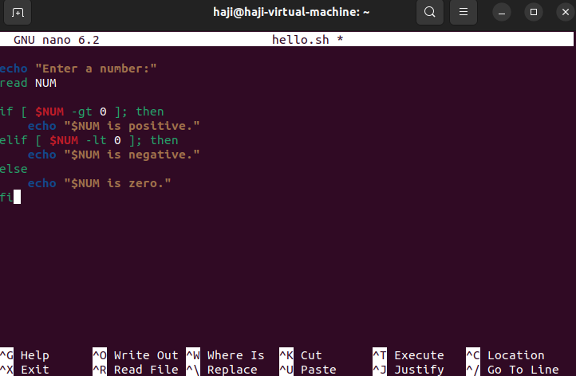
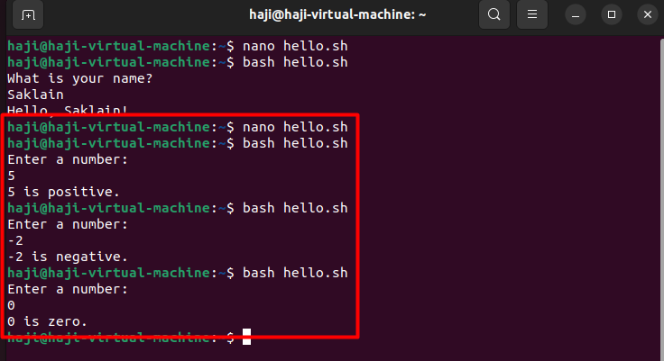


## **Loops (for and while)**

Loops allow you to repeat a block of code multiple times.

### For Loop

The `for` loop is typically used when you know the number of iterations in advance or when you want to iterate over a predefined list of items.

- The `for` loop initializes a variable `i` and iterates over the range `{1..5}`.
- In each iteration, the value of `i` is assigned to the variable `i`, and the commands inside the loop are executed.
- In this example, the loop will output "Count: 1", "Count: 2", ..., "Count: 5".


```bash
for i in {1..5}; do
    echo "Count: $i"
done
```
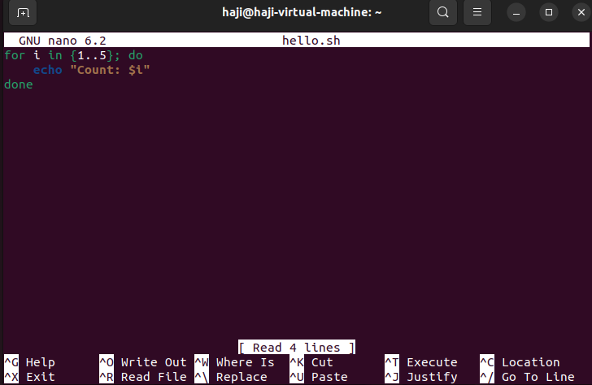


## **While Loop**


The `while` loop is used when you want to repeat a set of commands as long as a certain condition is true.

- The `while` loop checks the condition `[ $NUM -le 5 ]`, which means "while the value of `NUM` is less than or equal to 5".
- If the condition is true, the commands inside the loop are executed.
- In each iteration, the value of `NUM` is incremented by 1 using the `((NUM++))` expression.
- The loop continues to execute until the condition becomes false.


```bash
NUM=1
while [ $NUM -le 5 ]; do
    echo "Count: $NUM"
    ((NUM++))
done
```

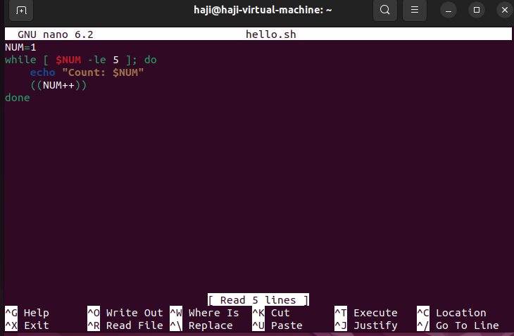

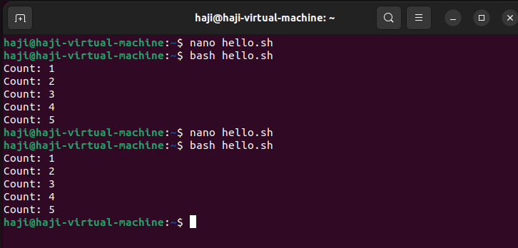


## **Functions**

Functions allow you to organize code into reusable blocks.

```bash
greet() {
    echo "Hello, $1!"
}

greet "Haji"
```

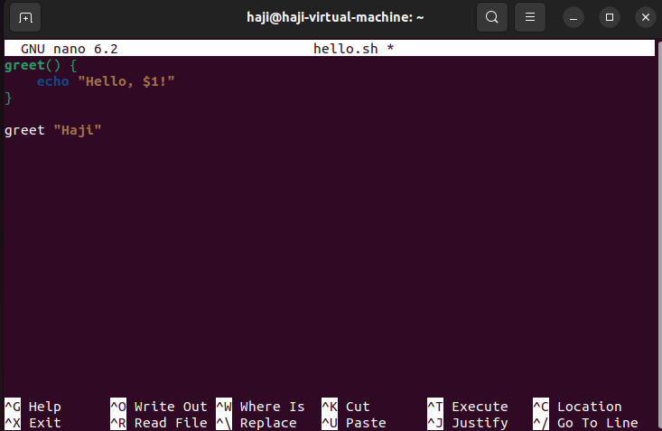 
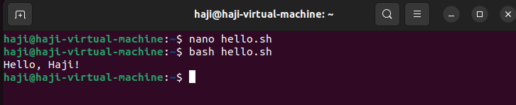 


## **Command Line Arguments**

You can pass arguments to a bash script from the command line.

```bash
echo "First argument: $1"
echo "Second argument: $2"
```
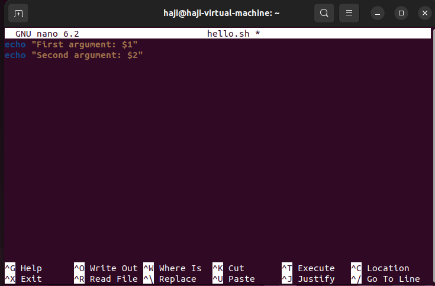 

Run the script with arguments:

```bash
bash hello.sh arg1 arg2
```

I have entered arg1 as Haji and arg2 as Saklain.

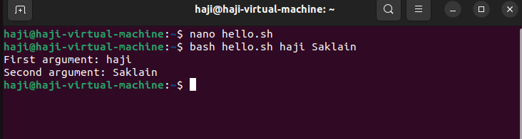 


